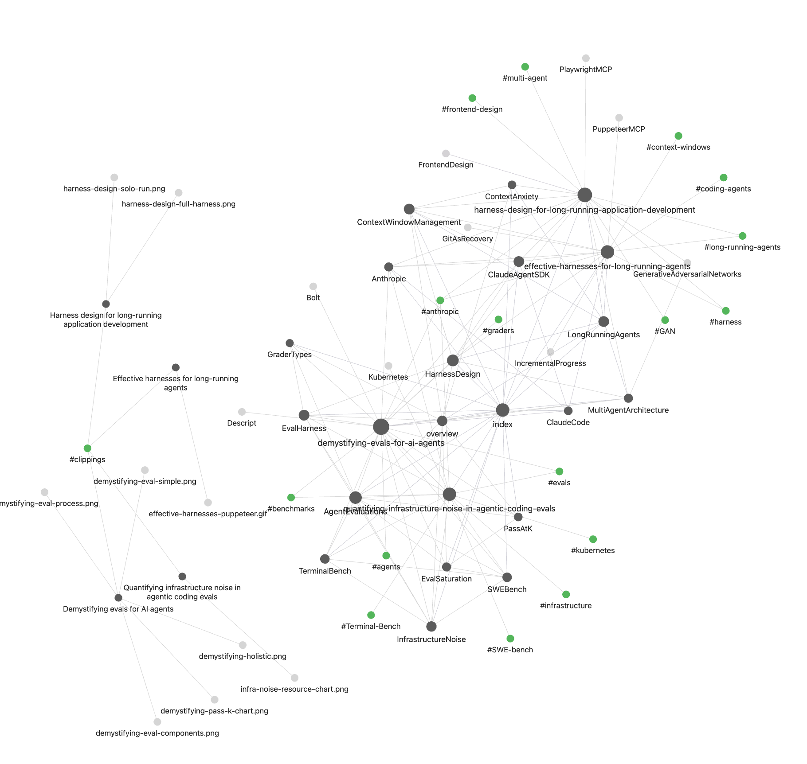

<div align="center">

<svg xmlns="http://www.w3.org/2000/svg" width="96" height="96" viewBox="0 0 96 96">
  <rect width="96" height="96" rx="20" fill="#1a1a2e"/>
  <text x="50%" y="68" font-family="Georgia, serif" font-size="64" font-weight="bold" fill="#ffffff" text-anchor="middle">W</text>
</svg>

# wikime

**An LLM Wiki skill for Claude Code, Codex, OpenCode, and Gemini CLI.**  
Drop documents into `raw/`, run one command, get a persistent interlinked knowledge base that compounds over time.

Implements [Andrej Karpathy's LLM Wiki pattern](https://x.com/karpathy/status/2039805659525644595).

---

### Knowledge Graph — auto-generated from your wiki



*Every ingest enriches the graph. Nodes are sources, entities, and concepts. Edges are extracted wikilinks and inferred relationships.*

---

</div>

## Install

### Option 1 — Skill (recommended)

Installs the wiki schema globally so any Claude Code session can build and query wikis without any per-project setup.

```bash
# Install all five skills at once:
npx skills add https://github.com/chandrasekaran1011/wikime --all -g

# Or install individually:
npx skills add https://github.com/chandrasekaran1011/wikime --skill wikime -g
npx skills add https://github.com/chandrasekaran1011/wikime --skill wiki-ingest -g
npx skills add https://github.com/chandrasekaran1011/wikime --skill wiki-query -g
npx skills add https://github.com/chandrasekaran1011/wikime --skill wiki-lint -g
npx skills add https://github.com/chandrasekaran1011/wikime --skill wiki-graph -g
```

Once installed, open any project in Claude Code, drop files into `raw/`, and say:

```
ingest raw/report.pdf
ingest all files in raw/
what does the wiki say about X?
lint the wiki
build the knowledge graph
```

### Option 2 — Slash commands (Claude Code)

If you want `/wiki-ingest`, `/wiki-query`, `/wiki-lint`, `/wiki-graph` as slash commands in a specific project, run `init.js` inside that project:

```bash
cd your-project

# Clone or download wikime, then:
node /path/to/wikime/init.js

# Also scaffold editable prompt templates:
node /path/to/wikime/init.js --prompts
```

This copies `CLAUDE.md`, `AGENTS.md`, `GEMINI.md`, and `.claude/commands/` into your project. Restart Claude Code and the `/wiki-*` commands will appear.

> **Note:** The skill (Option 1) and slash commands (Option 2) are independent. The skill works globally without any per-project files. The slash commands are just a convenience shortcut — they trigger the same behavior.

## Usage

### With the skill installed (any project)

```
ingest raw/report.pdf
ingest all files in raw/
query: what are the main themes?
what does the wiki say about X?
compare X and Y from the wiki
lint the wiki
build the knowledge graph
```

### With slash commands installed (Claude Code)

```
/wiki-ingest raw/report.pdf
/wiki-ingest raw/deck.pptx
/wiki-query "what are the main themes?"
/wiki-lint
/wiki-graph
```

### Codex / OpenCode / Gemini CLI

```
ingest raw/report.pdf
query: what are the main themes?
what does the wiki say about X?
lint the wiki
build the knowledge graph
```

## Supported Formats

| Format | Extension | Conversion |
|--------|-----------|------------|
| Markdown | `.md` | native |
| PDF | `.pdf` | markitdown / pdftotext / pdfminer |
| Word | `.docx` | markitdown / pandoc / python-docx |
| PowerPoint | `.pptx` | markitdown / python-pptx / pandoc |
| Excel | `.xlsx` | markitdown / openpyxl / pandas |
| CSV | `.csv` | built-in python |
| Images | `.png .jpg .webp .gif` | vision model (two-pass) |
| Plain text | `.txt .log .vtt .srt` | native |

**Recommended:** `pip install markitdown` — handles all formats with one tool.

## How It Works

The wiki has three layers:

```
raw/            # Layer 1 — your source documents (immutable, you own this)
wiki/           # Layer 2 — LLM-generated knowledge base (LLM owns this)
  index.md      #   catalog of all pages
  log.md        #   append-only operation log
  overview.md   #   living synthesis across all sources
  sources/      #   one page per ingested document
  entities/     #   people, companies, projects, products
  concepts/     #   ideas, frameworks, methods, theories
  syntheses/    #   saved query answers
graph/          # Layer 3 — auto-generated graph
  graph.json    #   node/edge data
  graph.html    #   interactive vis.js visualization (self-contained)
```

On every ingest, concept and entity pages are **read then expanded** — not replaced. The wiki gets richer with every document added.

## Customizing the Methodology

wikime ships with general-purpose extraction logic, but you can override any part of it by dropping prompt files into a `prompts/` directory at the root of your project. The LLM reads these files and follows them instead of the built-in defaults.

### Scaffold the prompts directory

```bash
node /path/to/wikime/init.js --prompts
```

Or create it manually:

```bash
mkdir prompts
```

### Available prompt overrides

There are exactly three prompt files the wiki recognizes. Each fires at a different stage of the ingest workflow:

---

#### `prompts/summarize.md` — Source reading & entity identification

**Fires during:** every ingest, when the LLM first reads a raw document
**Controls:**
- What sections to extract (parties, dates, financials, obligations, conditions)
- What to ignore (boilerplate, repetitive clauses)
- How to format extracted data (tables, timelines, bullet lists)
- **Which entities to flag for wiki page creation** — business units, verticals, financials, projects, relationships

> **This is the right place for entity extraction instructions.** Tell it here to identify business units, map project ownership, extract financial figures, and surface relationships between organizations. The LLM will list found entities at the end of the source page so the ingest workflow can create entity pages for each.

Example instructions to put here:
```markdown
Extract all named business units and verticals. For each, note:
- their parent organization
- any financial exposure or revenue mentioned
- which projects they own or are party to
Build a ## Entities Identified section at the end listing every
organization, unit, vertical, and project found.
```

---

#### `prompts/write-concept.md` — Concept page structure & relationships

**Fires during:** ingest step 8 — when creating or expanding `wiki/concepts/` pages
**Controls:**
- What counts as a concept in your domain (legal clauses, frameworks, risk types, deal structures)
- Page sections and their order
- **How to type and label relationships** between concepts (causes, triggers, limits, implements, contradicts)
- Rules for expanding existing pages when new sources are ingested

> **This is the right place for custom relationship types.** Define named relationships (e.g. `Triggers`, `Limits`, `Implements`) and the LLM will extract and label them consistently across all concept pages, making the knowledge graph far more useful.

Example instructions to put here:
```markdown
Extract typed relationships on every concept page:
- Triggers: [[ClauseA]] triggers [[ObligationB]]
- Limits: [[ConceptA]] limits [[ConceptB]]
- Implements: [[SpecificMechanism]] implements [[BroaderFramework]]
Add a ## Relationships section with these typed links.
```

> **Note:** Entity *page structure* (fields, sections on entity pages) is not controlled here — that lives in `CLAUDE.md`. This file only controls concept pages.

---

#### `prompts/caption-image.md` — Image description & visual extraction

**Fires during:** ingest step 2 (two-pass), when the LLM opens image files referenced in a document
**Controls:**
- How to handle different image types (org charts, process diagrams, scanned tables, signature pages, maps)
- Whether to transcribe text verbatim or summarize
- What entities to surface from visual content (org charts often reveal corporate structures not named in body text)

> **Don't skip this if your documents have org charts or financial diagrams.** Org charts are often the richest source of entity relationships — subsidiary chains, ownership percentages, business unit hierarchies — and without instructions the LLM may only give a brief description instead of a structured extraction.

---

### Where to put entity extraction for business units, verticals, financials, project relationships

| What you want to extract | Where to configure it |
|--------------------------|----------------------|
| Identify entities from document text | `prompts/summarize.md` — `## Entities Identified` section |
| Extract financials tied to entities | `prompts/summarize.md` — financial table instructions |
| Map project ↔ business unit relationships | `prompts/summarize.md` — relationship extraction instructions |
| Extract entities from org chart images | `prompts/caption-image.md` — org chart instructions |
| Structure of entity wiki pages | `CLAUDE.md` — entity page format section |
| Typed relationships between concepts | `prompts/write-concept.md` — relationship types section |

### Example prompt files (legal domain)

See [`example/prompts/`](example/prompts/) for fully worked examples covering:
- [`summarize.md`](example/prompts/summarize.md) — parties, timeline, financials, obligations, entity identification
- [`write-concept.md`](example/prompts/write-concept.md) — legal clause pages with typed relationships
- [`caption-image.md`](example/prompts/caption-image.md) — org charts, signature pages, scanned exhibits

Copy these into your project's `prompts/` directory and adapt to your domain.

### Combining overrides

All three files can be active at once. They fire at different stages and compose cleanly — summarize controls what's pulled from the source, write-concept controls how ideas are structured, caption-image controls visual extraction.

### Co-evolving the schema

For deeper changes — new page types, new frontmatter fields, custom index sections — edit `CLAUDE.md` directly. The prompts directory handles *how* to extract; `CLAUDE.md` handles *what structure* to write into. Both can be changed and will be respected.

---

## Tips

- Open as an **Obsidian vault** — `[[wikilinks]]`, graph view, and Dataview all work natively
- Use **Obsidian Web Clipper** to clip web articles directly to `raw/`
- **File query answers back** — ask "save this answer to the wiki" after a query
- **Lint regularly** — catches orphans, broken links, contradictions, and knowledge gaps
- **Co-evolve the schema** — edit `CLAUDE.md` / `AGENTS.md` to add domain-specific conventions
- The wiki is a **git repo** — version history for free, and LLM agents can `git blame` their own edits
- **Image two-pass rule** — the LLM reads markdown text first, then opens image files separately

## License

MIT
